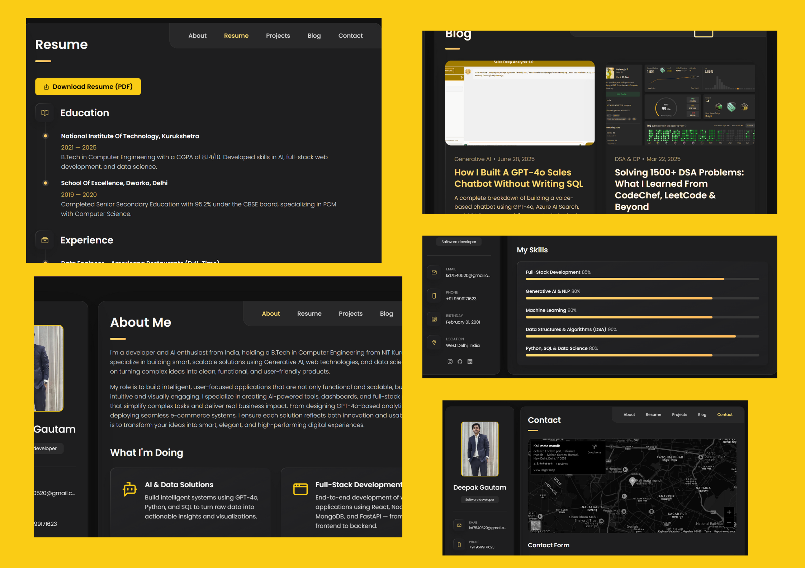
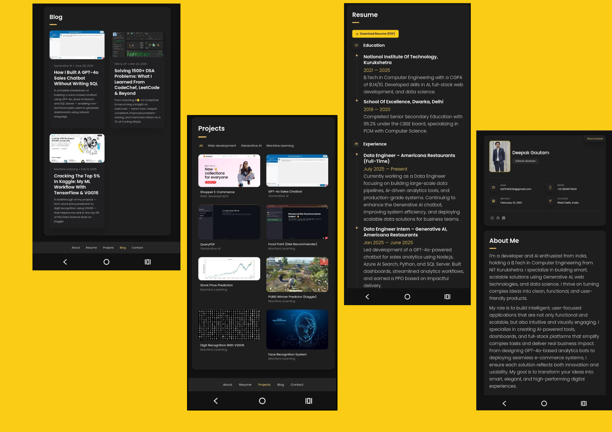

# Deepak Gautam - Personal Portfolio


This is my **personal portfolio website**, built with **HTML, CSS, and JavaScript**, showcasing my:

- **Generative AI & NLP Projects**
- **Full-Stack Web Development**
- **Machine Learning Projects**
- **DSA Coaching Contributions**

---

## 🌐 Live Demo

**[View My Portfolio](https://deepak-gautam1.github.io/Portfolio/)**

---

## 📸 Screenshots

| Desktop View                                      | Mobile View                                     |
| ------------------------------------------------- | ----------------------------------------------- |
|  |  |

---

## 📦 Installation

Clone this repository:

```bash
git clone https://github.com/Deepak-gautam1/Portfolio.git
```
